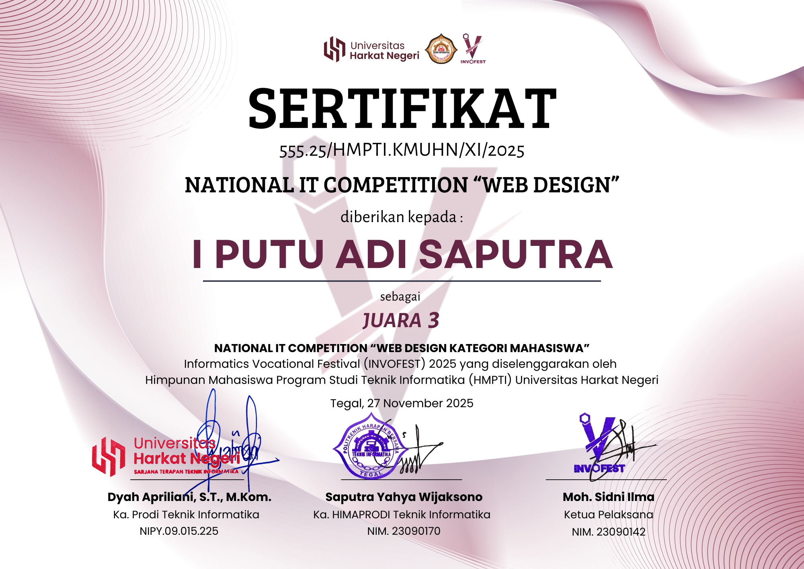
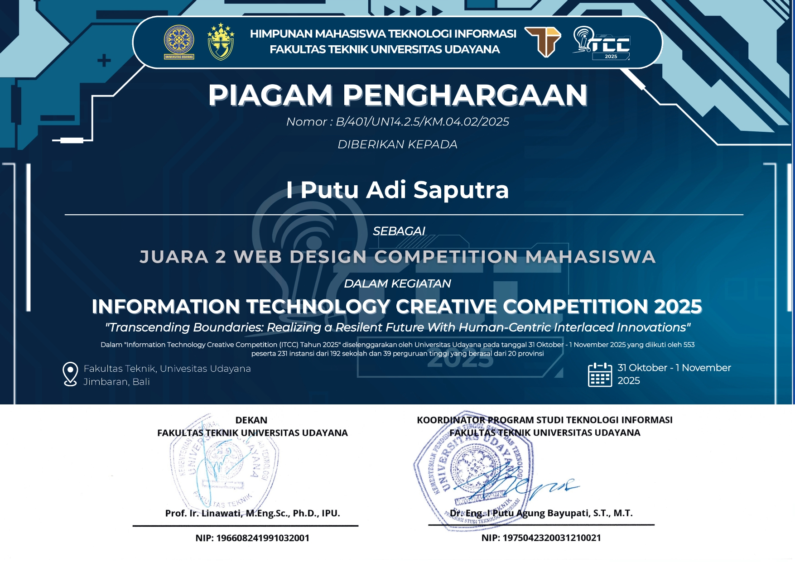
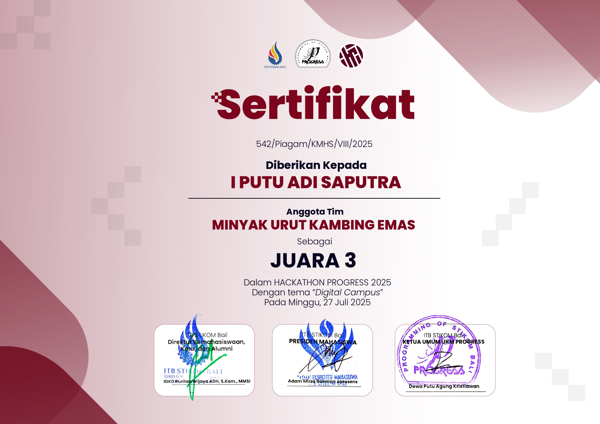
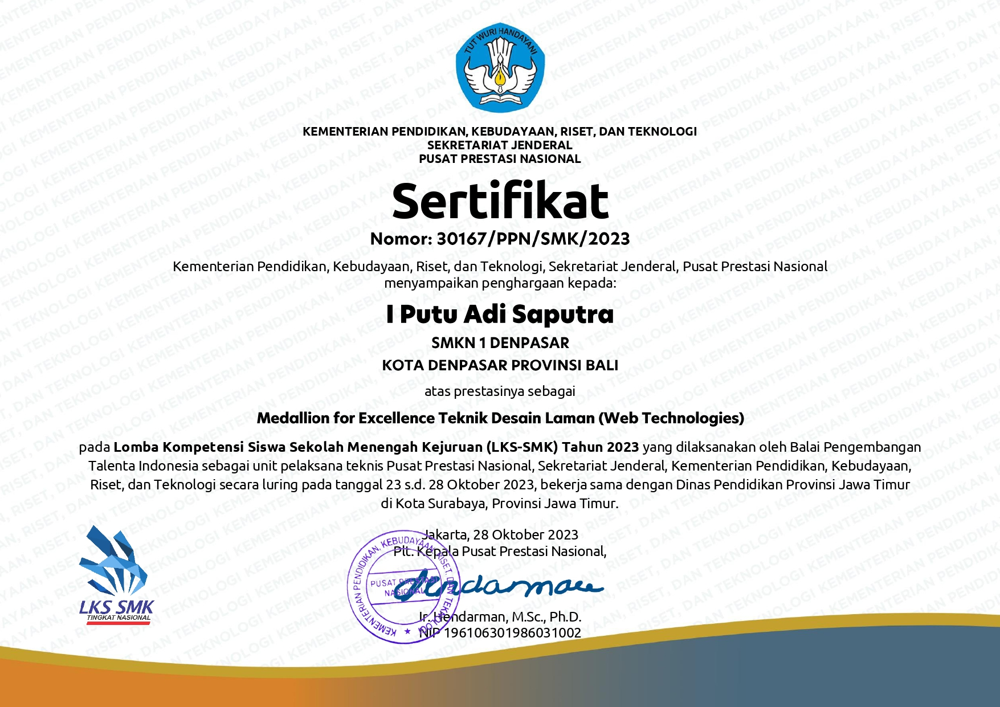

# I Putu Adi Saputra
**Full-Stack Developer · AI Builder · Web3 Enthusiast**

I build high-performance backend systems, modern user interfaces, and decentralized applications. Shifting between Laravel APIs and Next.js frontends, I design with a focus on optimization, clean architecture, and product value.

[Website Portfolio](https://adisaputra.vercel.app/) · [GitHub](https://github.com/adisaputra0/) · [Instagram](https://www.instagram.com/adisaputra5944/) · [Email](mailto:putuadi208@gmail.com)

---

## ⚡ About Me

I am a Full-Stack Engineer and AI Builder who enjoys bringing complex ideas to life. I approach development with a strong focus on clean code structure, performance, and user-centric design.

*   **Currently Building:** Advanced full-stack applications with Laravel, React, and Next.js.
*   **Learning Focus:** Blockchain ledger technology, smart contract development, and Rust.
*   **Open For:** Web development collaborations, frontend/backend roles, and AI engineering projects.

---

## 🛠️ Tech Stack

*   **Frontend:** React · Next.js · Vue.js · Tailwind CSS · Bootstrap
*   **Backend:** Laravel · PHP · RESTful APIs
*   **Databases:** MySQL
*   **Tools & Design:** Figma · Git · WordPress
*   **Interests:** Rust · Web3 & Blockchain · Game Development

---

## 💼 Professional Experience

### **Backend Developer (Intern)** · [PT. Hooki Global Kreasi](https://hookigroup.com/)
*Denpasar, Bali | Jun 2023 - Sep 2023*

*   **System Architecture:** Designed and built an export/import module utilizing Laravel, optimizing relational data pipelines.
*   **Security Integration:** Implemented secure user authentication flows using Laravel Sanctum to lock down API access points.
*   **RESTful APIs:** Engineered scalable API endpoints for database CRUD operations and complex role management.
*   **Tech Stack:** Laravel, PHP, MySQL, Git

### **Frontend Developer (Intern)** · [PT. Guna Teknologi Nusantara](https://redsystem.id/)
*Denpasar, Bali | Dec 2022 - Feb 2023*

*   **UI/UX Prototyping:** Translated Figma mockups into responsive web layouts using Vue.js and Tailwind CSS.
*   **Collaborative Shipping:** Partnered with backend teams to develop and launch the user interface for [reminderpasien.com](https://reminderpasien.com/).
*   **Technical Writing:** Authored comprehensive developer documentation to facilitate future design systems alignment.
*   **Tech Stack:** Vue.js, Tailwind CSS, Bootstrap, Figma, Git

---

## 🏆 Selected Recognition

| Competition | Result | Artifact |
| :--- | :---: | :--- |
| **Informatics Vocational Festival 2025** Web Design Championship | 🥉 3rd Place |  |
| **Information Technology Creative Competition** Creative Systems | 🥈 2nd Place |  |
| **Hackathon PROGRESS** Rapid System Prototyping | 🥉 3rd Place |  |
| **LKSN Web Technologies 2023** National Skills Finalist | 🏅 Medallion |  |

---

## 🎓 Education

*   **Primakara University** · *B.S. in Informatics* | 2024 - Present
*   **SMKN 1 Denpasar** · *Software Engineering (RPL)* | 2021 - 2024

---

  Designed with intentionality. Shipped in 2026.

