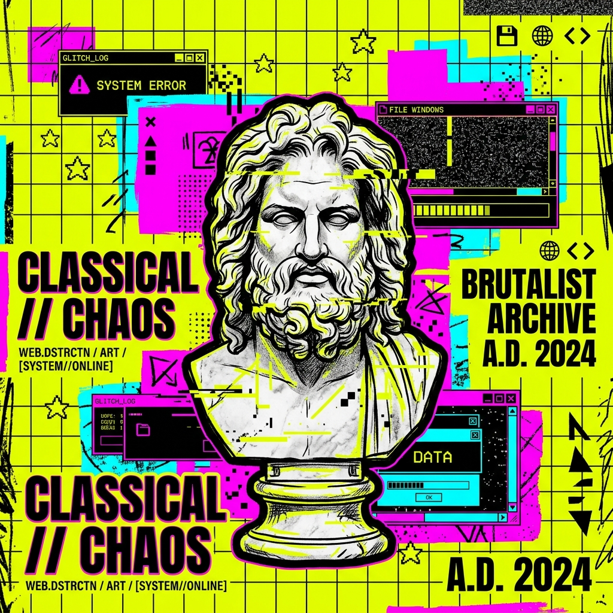

<!-- EXHIBIT HEADER -->
<p align="center">
  
</p>

<div align="center">

```
  ___   ___   ___    ____   _   _  ____   _   _  _____  ____    _    
 / _ \ |   \ |_ _|  / ___| / \ | ||  _ \ | | | ||_   _||  _ \  / \   
| |_| || |) | | |   \___ \/ _ \| || |_) || | | |  | |  | |_) |/ _ \  
|  _  ||  _/  | |    ___) /___ \ ||  __/ | |_| |  | |  |  _ <_____\ 
|_| |_||_|   |___|  |____/_/   \_|_|_|    \___/   |_|  |_| \_\     \
```

### [ 🏛️ MUSEUM CATALOG NO. 01 // INTERFACE ENGINEER & CREATIVE BUILDER ]

[](https://adisaputra.vercel.app/)
[](https://github.com/adisaputra0/)
[](https://www.instagram.com/adisaputra5944/)

</div>

---

## 📜 01 // THE MANIFESTO

> "I build for the open frontier. I design with weight, line, and contrast. Code is a structure to be sculpted, an artifact meant to endure."

*   **THE CREATOR:** I Putu Adi Saputra
*   **THE DISCIPLINE:** Software architecture meets high-contrast, brutalist design.
*   **THE EXPEDITIONS:** Currently investigating the architecture of decentralized systems, blockchain ledger technologies, and full-stack environments.
*   **THE BASE:** Informatics at **Primakara University**.
*   **THE TRANSMISSION:** Direct and secure link via [putuadi208@gmail.com](mailto:putuadi208@gmail.com).

---

## 🛡️ 02 // THE ARSENAL (WEAPONS OF CREATION)

```
[ BACKEND ORDNANCE ]
  ✦ Laravel      ████████████████████  [Enterprise API Design & Secure Auth]
  ✦ MySQL        ████████████████░░░░  [Relational Schemas & Query Logic]
  ✦ Git          ██████████████████░░  [Structured Repositories & Workflows]

[ FRONTEND CANVAS ]
  ✦ Vue.js       ████████████░░░░░░░░  [Reactive Component Frameworks]
  ✦ React/Next   ██████████░░░░░░░░░░  [Hydrated Rendering & Web3 Frontends]
  ✦ Tailwind CSS ██████████████████░░  [Utility-First Brutalist Style Layouts]
  ✦ Figma        ██████████████░░░░░░  [High-Fidelity Interface Blueprints]

[ AUXILIARY SYSTEMS ]
  ✦ WordPress    ████████████████░░░░  [Decentralized CMS Engineering]
```

---

## 🏆 03 // THE TROPHY ROOM (HALL OF FAME)
*Curated gallery of artistic web engineering and technical excellence.*

<table width="100%" style="border-collapse: collapse; border: 4px solid #000;">
  <tr style="background-color: #000; color: #fff;">
    <th colspan="2" style="padding: 12px; border: 2px solid #000; text-align: center; font-size: 1.2em; letter-spacing: 2px; font-family: monospace;">
      GALLERY REGISTRY
    </th>
  </tr>
  <tr>
    <td width="50%" style="padding: 20px; border: 2px solid #000; vertical-align: top; background-color: #fff;">
      <h3 style="margin-top: 0; margin-bottom: 5px; font-family: monospace; font-weight: bold; font-size: 1.3em;">🥉 3RD PLACE</h3>
      <b>Informatics Vocational Festival 2025</b><br>
      <i>Web Design Championship</i>
      <p style="font-size: 0.9em; line-height: 1.4; color: #333;">Honored for creative visual compositions, asymmetrical layouts, and stellar responsive performance under rigorous jury examination.</p>
      <br>
      
    </td>
    <td width="50%" style="padding: 20px; border: 2px solid #000; vertical-align: top; background-color: #fff;">
      <h3 style="margin-top: 0; margin-bottom: 5px; font-family: monospace; font-weight: bold; font-size: 1.3em;">🥈 2ND PLACE</h3>
      <b>Information Technology Creative Competition (ITCC)</b><br>
      <i>Creative Systems Engineering</i>
      <p style="font-size: 0.9em; line-height: 1.4; color: #333;">Awarded for excellence in prototyping, systems planning, and demonstrating interactive user experiences.</p>
      <br>
      
    </td>
  </tr>
  <tr>
    <td width="50%" style="padding: 20px; border: 2px solid #000; vertical-align: top; background-color: #fff;">
      <h3 style="margin-top: 0; margin-bottom: 5px; font-family: monospace; font-weight: bold; font-size: 1.3em;">🥉 3RD PLACE</h3>
      <b>Hackathon PROGRESS</b><br>
      <i>Rapid Prototype Deployment</i>
      <p style="font-size: 0.9em; line-height: 1.4; color: #333;">Engineered and deployed a functional full-stack solution to address complex modern challenges within a compressed timeline.</p>
      <br>
      
    </td>
    <td width="50%" style="padding: 20px; border: 2px solid #000; vertical-align: top; background-color: #fff;">
      <h3 style="margin-top: 0; margin-bottom: 5px; font-family: monospace; font-weight: bold; font-size: 1.3em;">🏅 EXCELLENCE MEDAL</h3>
      <b>LKSN Web Technologies 2023</b><br>
      <i>National Skills Competition</i>
      <p style="font-size: 0.9em; line-height: 1.4; color: #333;">National finalist recognition, achieving a benchmark score exceeding 700 points across system automation, API modeling, and speeds tests.</p>
      <br>
      
    </td>
  </tr>
</table>

---

## 🗺️ 04 // EXPEDITIONS & CHRONICLES
*A ledger of professional engineering assignments and shipped software.*

```
EXPEDITION 01 // [PT. Hooki Global Kreasi](https://hookigroup.com/) // BACKEND ARCHITECT
─────────────────────────────────────────────────────────────────────────────
• Period:     Jun 2023 - Sep 2023 | Denpasar, Bali
• Scope:      Designed and engineered a high-volume Export & Import Engine using Laravel.
• Operations:
  ┌──
  │ ✦ Core Systems: Constructed optimized export-import logic pipelines using PHP/Laravel.
  │ ✦ Access Gates: Implemented secure auth tokens using Laravel Sanctum middleware.
  │ ✦ API Engineering: Built RESTful API endpoints enforcing strict validation controls.
  └──
─────────────────────────────────────────────────────────────────────────────
```

```
EXPEDITION 02 // [PT. Guna Teknologi Nusantara](https://redsystem.id/) // FRONTEND ARCHITECT
─────────────────────────────────────────────────────────────────────────────
• Period:     Dec 2022 - Feb 2023 | Denpasar, Bali
• Scope:      Figma blueprints translation, site modifications, and responsive optimization.
• Operations:
  ┌──
  │ ✦ UI Engineering: Translated design systems from Figma into production HTML/CSS templates.
  │ ✦ Collaboration: Worked with engineering squads to build and ship [reminderpasien.com](https://reminderpasien.com/).
  │ ✦ Technical Writing: Documented modular frontend code architectures for team guidelines.
  └──
─────────────────────────────────────────────────────────────────────────────
```

---

## 🎓 05 // THE ACADEMY

```
┌───────────────────────────────────────────────────────────────────────────┐
│ THE ACADEMY LOGS                                                          │
├───────────────────────────────────────────────────────────────────────────┤
│                                                                           │
│  [INSTITUTION]   PRIMAKARA UNIVERSITY                                     │
│  [DISCIPLINE]    Informatics (Bachelor's Degree)                          │
│  [TIMEFRAME]     2024 - Present                                           │
│  [FOCUS AREAS]   Web3 Architectures, Decentralized Tech, Data Systems     │
│                                                                           │
├───────────────────────────────────────────────────────────────────────────┤
│                                                                           │
│  [INSTITUTION]   SMKN 1 DENPASAR                                          │
│  [DISCIPLINE]    Software Engineering (RPL)                               │
│  [TIMEFRAME]     2021 - 2024                                              │
│  [FOCUS AREAS]   OOP Foundations, Relational Databases, Web Development   │
│                                                                           │
└───────────────────────────────────────────────────────────────────────────┘
```

---

## 📡 06 // THE SIGNALS

*   **Secured Dispatch Line:** [putuadi208@gmail.com](mailto:putuadi208@gmail.com)
*   **Virtual Gateway:** [adisaputra.vercel.app](https://adisaputra.vercel.app/)
*   **Visual Logs:** [@adisaputra5944](https://www.instagram.com/adisaputra5944/)

```
       __________________________________________________
      |                                                  |
      |   "THE FUTURE BELONGS TO THOSE WHO BUILD IT."    |
      |__________________________________________________|
```
